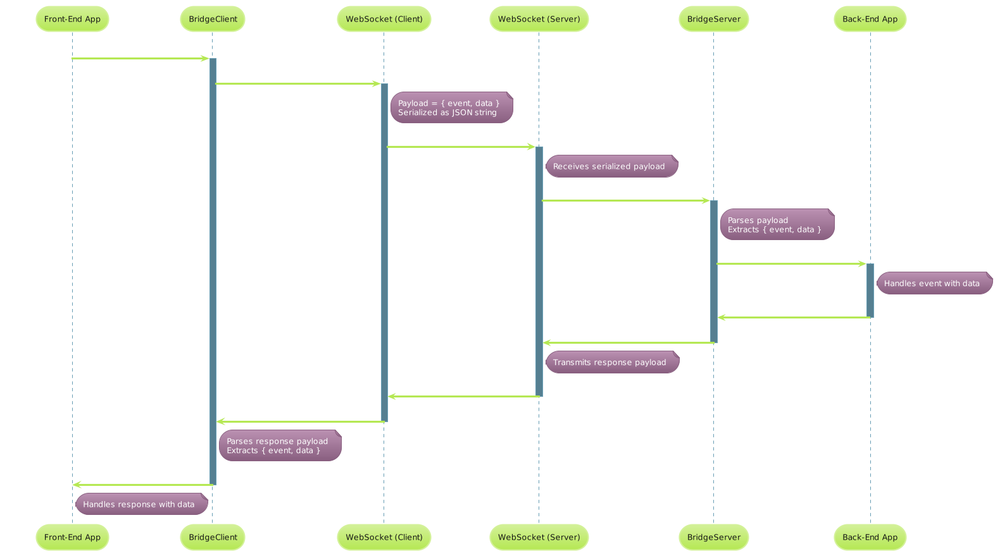

# Brainstack WebSocket Communication Framework

## Introduction
This README outlines the standard definitions and terms used in the WebSocket Communication Framework, specifically focusing on the BridgeServer and BridgeClient classes. Understanding these definitions is crucial for developers who intend to implement or interact with the framework.

## Definitions

### Payload
- **Definition**: The payload refers to the entire data packet sent over the WebSocket connection. It is typically a JSON object when serialized.
- **Structure**: `{ event: string, data: any }`
- **Responsibility**: The payload carries both the event identifier and the actual data.

### Event
- **Definition**: An event is a string identifier that specifies the type of action or communication intended. It is used to route the payload to appropriate handlers.
- **Responsibility**: Events categorize payloads, enabling the framework to invoke corresponding event handlers.

### Data
- **Definition**: The data is the actual content or information that needs to be communicated. It is a part of the payload.
- **Responsibility**: Data carries the substantive information that the sender wishes to communicate to the receiver.

### EventHandler
- **Definition**: An EventHandler is a function or method defined to handle specific events.
- **Responsibility**: When an event occurs, the corresponding EventHandler is invoked with the data part of the payload.

## Data Flow

1. **Sending Data (Client to Server)**:
   - The client prepares the payload with the appropriate event name and data.
   - The payload is serialized (if not already) and sent over the WebSocket connection.
   - Example: `{ event: "message", data: { text: "Hello" } }`

2. **Receiving and Processing Data (Server)**:
   - The server receives the serialized payload.
   - The server parses the payload to JSON and extracts the event name and data.
   - The server invokes the appropriate EventHandler with the data.

3. **Response or Acknowledgment (Server to Client)**:
   - The server may respond with a payload formatted similarly, containing an event name and relevant data.
   - Example: `{ event: "messageReceived", data: { status: "ok" } }`

4. **Receiving and Handling Responses (Client)**:
   - The client receives the response payload.
   - The client processes the payload, invoking corresponding EventHandlers.

### UML Sequence

This diagram illustrates the following process:

1. **Front-End App to BridgeClient**: The front-end application sends a message through the BridgeClient, specifying the event and data.
2. **BridgeClient to WebSocket (Client-side)**: The BridgeClient serializes the payload into a JSON string and sends it through the WebSocket client.
3. **WebSocket Communication**: The message is transmitted over the WebSocket connection from the client to the server.
4. **WebSocket (Server-side) to BridgeServer**: The server-side WebSocket receives the message and passes the payload (as a Buffer) to the BridgeServer for processing.
5. **BridgeServer Processing**: The BridgeServer parses the payload, extracting the event and data, and invokes the appropriate event handler in the back-end application.
6. **Response from Back-End App to Front-End App**: The back-end application processes the request and sends a response back through the same channel: BridgeServer -> WebSocket (Server) -> WebSocket (Client) -> BridgeClient -> Front-End App.
7. **Handling the Response**: Each layer unpacks or parses the payload as needed and forwards the relevant data to the next component until it reaches the front-end application, where the final response is handled.

## Best Practices

- **Consistency in Payload Structure**: Always maintain the `{ event, data }` structure for seamless communication.
- **Event Naming**: Use clear, descriptive event names. Preferably use camelCase for event names.
- **Error Handling**: Implement robust error handling on both client and server sides to manage unexpected situations gracefully.
- **Data Validation**: Validate data both before sending and after receiving to ensure data integrity and prevent security vulnerabilities.
- **Logging**: Utilize logging for debugging and monitoring purposes. Ensure logs are clear and provide enough context.

## Conclusion

This README serves as a guideline for understanding the core components and standard practices within the WebSocket Communication Framework. Adhering to these standards ensures efficient and error-free communication between clients and servers.
