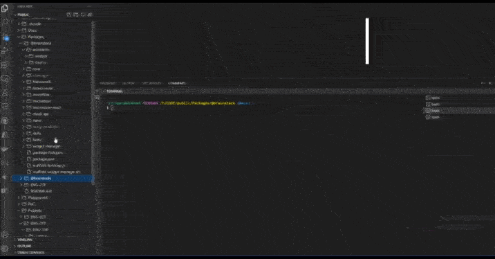

# @braintools/template


Part of the Brainstack, `@braintools/template` is a zero-code template generation and instantiation tool for lazy coders. This npm package allows you to create templates based on a source directory and then instantiate those templates by replacing tokens with user-specified values. The tool automatically handles token generation and replacement, making it a powerful utility to speed up the development process.

## Features

- Token Generation: Automatically generates unique tokens based on the values you provide. No need for manual token management.
- Token Replacement: Instantiates templates by replacing tokens with user-specified values, quickly creating new instances based on the template.
- Metadata Saving: Saves token metadata (`__template__meta__.json`) in the template directory, making it easy to reuse and share templates.
- Hassle-Free: User-friendly prompts guide you through the process, making it easy for both new and experienced developers.



## Installation

To install the Template Generator and Instantiator tool, run the following command:

```
npm install @braintools/template
```

## Usage

Once installed, you can use the tool by running the following commands:

### Generate Template

To generate a template based on a source directory, run the following command:

```
npx generate_template
```

Follow the prompts to specify the source directory, template directory, and values to be replaced with tokens.

### Instantiate Template

To instantiate a template by replacing tokens with user-specified values, run the following command:

```
npx instantiate_template
```

Follow the prompts to specify the source (template) directory, destination (output) directory, and values for tokens based on the descriptions provided in the metadata file.

## Repository

The source code for this package is available on GitHub:

- Repository: [https://github.com/Infinisoft-inc/public.git](https://github.com/Infinisoft-inc/public.git)
- Issues: [https://github.com/Infinisoft-inc/public/issues](https://github.com/Infinisoft-inc/public/issues)
- Contribute: [https://github.com/Infinisoft-inc/public/blob/main/CONTRIBUTING.md](https://github.com/Infinisoft-inc/public/blob/main/CONTRIBUTING.md)

## Author

Infinisoft World <info@infinisoft.dev>

## License

This tool is provided "as is" under the MIT License. Feel free to use, modify, and distribute it as needed